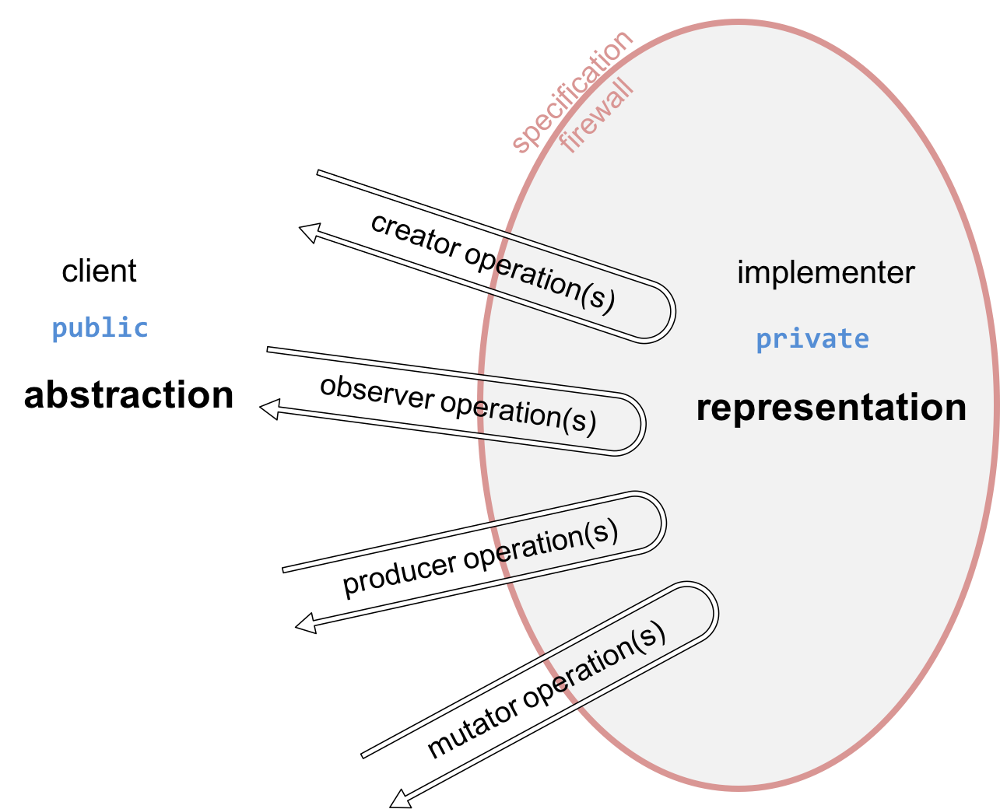

# 抽象数据类型
- 数据结构的使用方式与数据结构本身的特定形式区分开
- 抽象数据类型解决了一个特别危险的问题：客户端对类型的内部表示形式进行假设

## 抽象的意义
- 抽象
  - 使用简单高级的想法，忽略低级细节
  - 规范是一种抽象，客户仅需了解其使用的前提条件和后置条件，而无需了解完整内部行为
- 模块化
  - 将系统划分为组件或模块
  - 每个组件或模块都可以与其余部分分开设计，实施，测试，推理和重用
  - 单元测试和规范有助于将方法整合为模块
- 封装
  - 模块负责其自身的内部行为，系统其他部分中的错误不会破坏其完整性
  - 方法的局部变量被封装
  - 避免使用可变对象
- 信息隐藏
  - 隐藏系统其他模块的实现细节
  - 以后可以独立更改
  - 规范使用信息隐藏为方法的实现者留出一定的自由度
- 关注点分离
  - 单个功能是单个模块的责任，而不是多个模块的责任
  - 规范仅负责一个关注点

## 抽象类型的特点
- 数据抽象的关键思想是，类型的特征在于可以对其执行的操作。
  - 数字是可以加和乘的东西。
  - 字符串是可以连接并采用其子字符串的东西；
  - 布尔值是可以抵消的东西
- 抽象类型变得新颖和与众不同的是对操作的关注
  - 类型的用户不必担心其值的实际存储方式
  - 就像程序员可以忽略编译器实际上如何存储整数的方式一样。
  - 而把主要的注意力集中于操作。

## 抽象类型的操作
- 类型可分为可变和不可变两类
- 抽象类型的操作分类如下：
  - Creators: 
    - 创建该类型的新对象。
    - 创建者可以将一个对象作为参数，但不能将其构造为对象。
  - Producers:
    - 从该类型的旧对象创建新对象。
    - `String` 的 `concat` 方法是一个生产器
    - 它接受两个字符串并产生一个表示它们的串联的新字符串。
      - `public String concat(String s);`
      - `a = a.concat("another String");`
  - Observers:
    - 获取抽象类型的对象并返回不同类型的对象
      - `List` 的 `size` 函数返回一个 `int`
  - Mutators:
    - 改变对象
      - `List` 的 `add` 函数
- 可以用以下形式表示（T 代表抽象类型本身， t 代表其他类型， + 代表出现 >= 1 次， * 代表出现 >= 0 次，| 代表或）
  - creator : t* → T
    - `>= 0` 个其他类型，产生了抽象类型 T
    - 构造器 `constructor`，` new ArrayList()`
    - 也可以是个静态方法 `Arrays.asList()`
      - 由静态方法实现 `creator` 称为 **工厂方法**
      - `String.valueOf(参数)` 把参数变量变为 String，也是工厂方法
  - producer : T+, t* → T
    - `>= 1` 本类型和 `>= 0` 个其他类型，产生了抽象类型 T
    - `concat` : `String × String → String`
  - observer : T+, t* → t
    - `>= 1` 本类型和 `>= 0` 个其他类型，产生了其他类型 t
    - `size` : `List → int`
    - `regionMatches()` （用于检测两个字符串在一个区域内是否相等） : ` String × boolean × int × String × int × int → boolean`
  - mutator : T+, t* → void | t | T
    - `>= 1` 本类型和 `>= 0` 个其他类型，改变了本类型 T 的情况，产生的任意可能的输出
    - 返回为 `void` 通常是 mutator 的信号
  
### 例子
- `int` 原始类型，无法改变，因此没用 mutator
  - creators
    - 0, 1, 2, ...
  - producers
    - +, -, *, /
  - observers
    - ==, !=, >, <

- `List` 可变类型
  - creators
    - `ArrayList` 和 `LinkedList` 的构造函数
  - producers
    - `Collections.unmodifiableList(List list)` 返回一个不可修改的 List (但对原 List 修改该返回值的列表也会变化)
  - observers
    - size, get
  - mutator
    - add, remove, addAll, Colections.sort

- String
  - creators
    - String 构造函数，String.valueOf(...) 静态方法(工厂模式)
  - producers
    - concat, substring, toUpperCase
  - observers
    - length, charAt

## 抽象类型由其操作定义


- 核心思想：抽象类型是由它的操作定义的
- 我们讨论的是一组不透明值的对象，而不是单指 List
- 同时这组对象都满足我的要求：get, size 等等
- 抽象类型的值是不透明的
- 不仅隐藏单个功能的实现，而且还隐藏一组相关功能及其共享的数据

## 设计抽象类型
- 设计一些简单的操作
- 每个操作都应具有明确的目的，并且应具有连贯的行为，而不是一堆特殊情况
- 操作的数量对于客户可能想要做的计算是足够的
- 类型可以是通用的
  - list, set, graph 这种通用类型的 add 方法
  - street map, an employee database, a phone book 这种专业领域的 dealCards 方法
  - 但两者混用则不合适，如 add 用于专业领域或 dealCards 用于通用类型则不合适

## 表示的独立性
- 一个好的抽象数据类型应该是独立于表示的
- 抽象类型与其实现无关
  - List 提供的操作与内部实现为链表还是数组无关

```java
// 不独立的例子
void client1(Family f) {
    // get youngest person in the family
    Person baby = f.people.get(f.people.size()-1);
    ...
}
// 这个情况下，client1 的实现取决于 f.people 这个类型是否支持 get 方法
// Family 变化时， client1 有可能无法工作，因此是不独立的

// 更好的方法
void client3(Family f) {
    // get any person in the family
    Person anybody = f.getMembers().get(0);
    ...
}
// 使 getMembers() 满足规范即可，并且是独立的
```

### 例子
- 哪些是表现形式、规范、实现方式
```java
/**
 * Represents a family that lives in a household together.
 * A family always has at least one person in it.
 * Families are mutable.
 */
public class Family {

    // the people in the family, sorted from oldest to youngest, with no duplicates.
    private List<Person> people;

    /**
     * @return a list containing all the members of the family, with no duplicates.
     */
    public List<Person> getMembers() {
        return people;
    }
}
```

- 规范包括类名词，Javadoc 和公共方法及注释

```java
/**
 * Represents a family that lives in a household together.
 * A family always has at least one person in it.
 * Families are mutable.
 */
public class Family {

    ....

    /**
     * @return a list containing all the members of the family, with no duplicates.
     */
    public List<Person> getMembers() {
        ...    
    }
}
```

- 表现形式包括 private fields 和对 fields 的假设和要求

```java
    // the people in the family, sorted from oldest to youngest, with no duplicates.
    private List<Person> people;
```

- 实现方法为对函数的具体实现

```java
        return people;
```

## 在 Java 中实现 ADT 概念

|ADT 概念|用 Java 实现的方法|例子|
|:---:|:---:|:---:|
|抽象数据类型|Class,Interface + class(es),Enum|String,List and ArrayList, DayofWeek|
|Creator|Constructor,Static (factory) method,Constant|ArrayList(),Collections.singletonList(), Arrays.asList(),BigInteger.ZERO|
|Observer|实例方法，静态方法|List.get(),Collections.max()|
|Producer|实例方法，静态方法|String.trim(),Collections.unmodifiableList()|
|Mutator|实例方法，静态方法|List.add(),Collection.copy()|
|Representation|`private` fields||

- 使用枚举（enum）定义抽象数据类型。枚举非常适合具有固定值小的ADT，例如星期一，星期二等星期几
- 使用常量对象作为创建者操作。这种模式通常出现在不可变的类型中

## 测试抽象数据类型
- 每个操作创建测试来构建测试套件会不可避免地会相互影响
  - 测试 Creator,Producer,Mutator 的唯一方法是在生成的对象上调用 Observer
  - 每个测试用例通常都会调用一些操作来创建或修改类型的对象（创建者，生产者，更改者），以及一些检查类型的对象的操作（观察者）
  - 每个测试用例涵盖了几个操作的一部分

```java
@Test public void testValueOfTrue() {
    MyString s = MyString.valueOf(true);
    assertEquals(4, s.length());
    assertEquals('t', s.charAt(0));
    assertEquals('r', s.charAt(1));
    assertEquals('u', s.charAt(2));
    assertEquals('e', s.charAt(3));
}

@Test public void testValueOfFalse() {
    MyString s = MyString.valueOf(false);
    assertEquals(5, s.length());
    assertEquals('f', s.charAt(0));
    assertEquals('a', s.charAt(1));
    assertEquals('l', s.charAt(2));
    assertEquals('s', s.charAt(3));
    assertEquals('e', s.charAt(4));
}

@Test public void testEndSubstring() {
    MyString s = MyString.valueOf(true).substring(2, 4);
    assertEquals(2, s.length());
    assertEquals('u', s.charAt(0));
    assertEquals('e', s.charAt(1));
}

@Test public void testMiddleSubstring() {
    MyString s = MyString.valueOf(false).substring(1, 2);
    assertEquals(1, s.length());
    assertEquals('a', s.charAt(0));
}

@Test public void testSubstringIsWholeString() {
    MyString s = MyString.valueOf(false).substring(0, 5);
    assertEquals(5, s.length());
    assertEquals('f', s.charAt(0));
    assertEquals('a', s.charAt(1));
    assertEquals('l', s.charAt(2));
    assertEquals('s', s.charAt(3));
    assertEquals('e', s.charAt(4));
}

@Test public void testSubstringOfEmptySubstring() {
    MyString s = MyString.valueOf(false).substring(1, 1).substring(0, 0);
    assertEquals(0, s.length());
}
```
- 每个测试用例都调用一些操作来创建或修改类型的对象（创建者，生产者，更改者），以及一些检查类型的对象的操作（观察者）
- 每个测试用例涵盖了几个操作的一部分。

## 总结
- 抽象数据类型的核心在于注重于操作
- 操作可以分为创建者，生产者，观察者和变异者
- 一个 ADT 的规范就是它的操作集（创建者，生产者，观察者和变异者）和它们的规范
- 好的 ADT 是简单，连贯，适当且独立于表示的
- 通过为每个操作生成测试来测试 ADT，但在同一测试中同时使用创建者，生产者，变异者和观察者

- 一个好的ADT为数据类型提供了一个定义良好的规范
  - 客户就知道从数据类型中可以得到什么，而实现者也有定义良好的自由度去变化。
- 易于理解
  - 一个好的ADT将它的实现隐藏在一组简单的操作后面
  - 因此使用ADT的程序员只需要理解操作，而不是实现的细节。
- 准备改变
  - 表示的独立性允许抽象数据类型的实现在不需要其客户端更改的情况下进行更改


