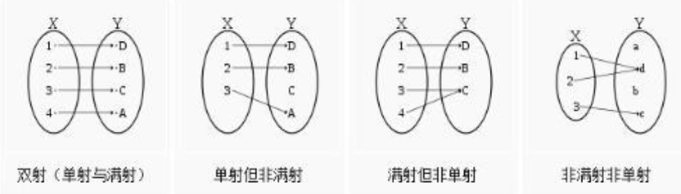
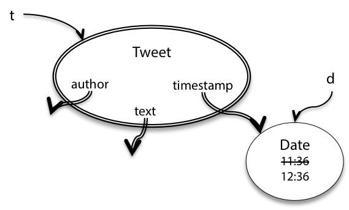
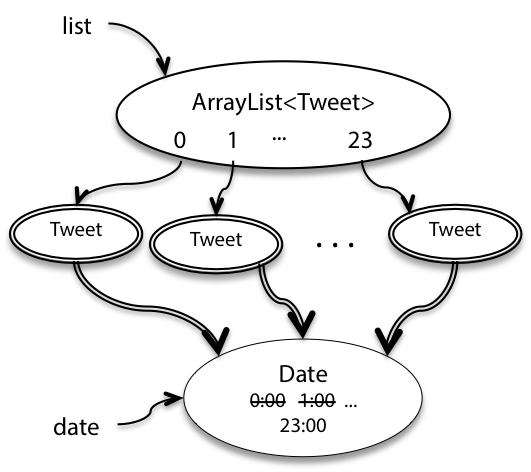
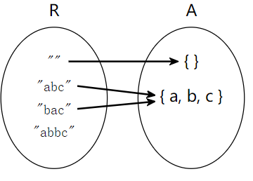
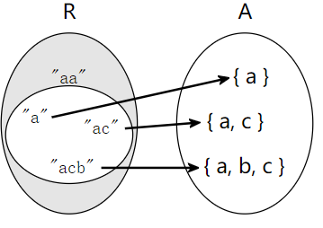
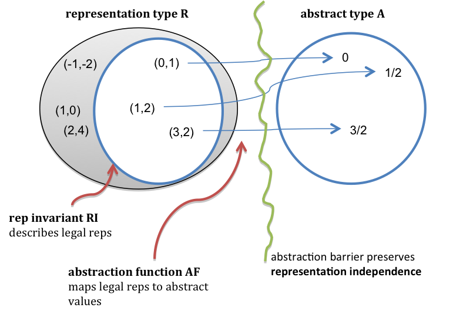
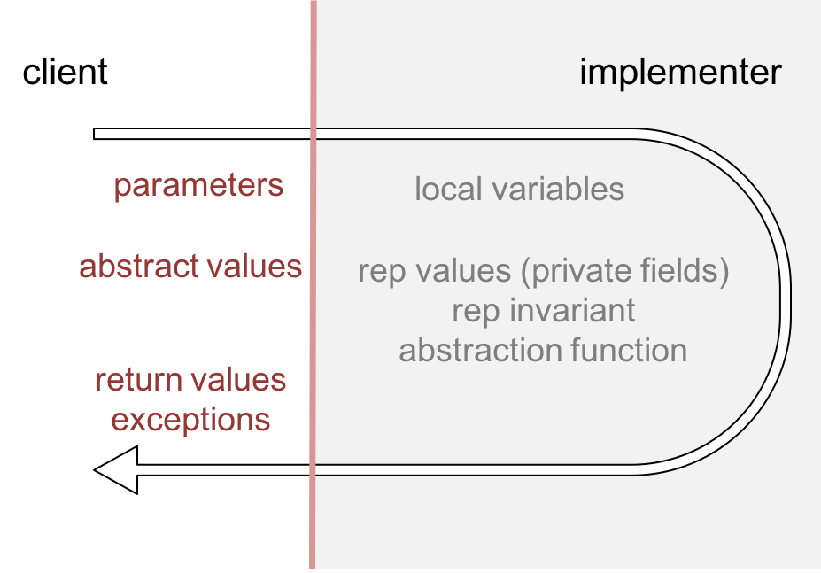

# 抽象函数与表示不变量
翻译原文：https://www.cnblogs.com/liqiuhao/p/8688759.html
阅读的其他人的笔记：https://blog.csdn.net/Hey_BlingBling/article/details/107215806

上一章的重要概念
- 表示独立性（Representation Independence， RI）
  - 客户在使用ADT时无需考虑ADT的内部实现，只需要根据ADT的规约进行使用即可
  - 关键在于将数据结构的使用和数据结构自身的形式分离
  - 防止因为用户在使用过程中假设ADT内部的实现，在假设的基础上形成依赖

这一章涉及到的概念
- 不变量（invariants）
  - ADT创建之后就不会发生改变的量，在ADT存在的时间范围内恒为True，不受外部使用者的操作所影响。
  - 若ADT的不变量发生改变，则说明这个ADT已经发生变异，程序运行过程中的某个地方存在bug
- 表示暴露（representation exposure）
  - 类外部的代码可以直接修改类内部存储的数据
- 抽象函数（abstraction functions）& 表示不变量（representation invariants）
  - 表示空间R和抽象空间A
    - 表示空间R指的是**开发人员**实际实现时内部的值
    - 抽象空间A表示的是**用户**看到的和使用的值
    - 开发人员更关注R，而用户更关注A。
  - 抽象函数AF
    - 如何将表示空间中的一个值解释为抽象空间中的一个值
    - AF是一个满射，即用户所看到或使用的任意一个值都是由一个表示值映射而来的。
    - AF未必是一个单射，即用户户所看到或使用的任意一个值可能由不止一个表示值映射而来。
        - AF未必是一个双射（单射+满射，也叫一一对应），即开发人员所面对的表示值中，会存在不满足前置条件的表示值，对于这类表示值不存在对应的抽象值。
  - 表示不变量
    - 怎样的表示值无法被映射呢？
    - 表示不变量 RI 是由表示值空间 R 到 boolean 值的一个映射
    - 映射为 true 的值可以被映射到抽象空间中，否则无法被映射
    - RI 告诉了我们表示空间R中的值能否被映射到抽象空间 A 中，也可以认为 RI 构成了表示空间R的一个子集，该子集中的值能够被映射到抽象空间 A 中
  - 构建 ADT 的步骤
    - 选定表示空间（R）
    - 选定其中满足条件的子集（RI）
    - 为子集中的每个元素做出对应的解释（AF）
    - 映射到抽象空间（A）
  


- 用一种正规的数学思想（抽象函数和表示不变量）去理解抽象数据类型 ADT 的实现
- 抽象函数会让我们清晰的定义对两个 ADT 判断相等的操作
- 表示不变量会让我们更易发现破坏数据结构导致的 bug

## 不变量
- 什么设计会产生好的 ADT ？
  - 最重要是会**保护自己的不变量**
- 不变量是一种属性，它在程序运行的时候总是一种状态，而不变性就是其中的一种：
  - 一旦一个不变类型的对象被创建，它总是代表一个不变的值
- 当一个ADT能够确保它内部的不变量恒定不变（不受使用者/外部影响），我们就说这个 ADT 保护/保留自己的不变量。
  - 保护了不变量 -> 对代码的分析会变得更简单
    - 字符串不变 -> 分析的时候跳过关于字符串的代码
    - 基于字符串建立其他的不变量 -> 分析的时候跳过
  - 可变的对象 -> 不得不对每一处使用它的代码处进行审查
  
### 不变性
```java
/**
 * This immutable data type represents a tweet from Twitter.
 */
public class Tweet {

    public String author;
    public String text;
    public Date timestamp;

    /**
     * Make a Tweet.
     * @param author    Twitter user who wrote the tweet
     * @param text      text of the tweet
     * @param timestamp date/time when the tweet was sent
     */
    public Tweet(String author, String text, Date timestamp) {
        this.author = author;
        this.text = text;
        this.timestamp = timestamp;
    }
}
```
- 怎么样做才能确保Tweet对象是不可变的?(一旦被创建，author, message, 和 date都不能被改变)

- 第一个威胁就是使用者可以直接访问 Tweet 内部的数据

```java
Tweet t = new Tweet("justinbieber", 
                    "Thanks to all those beliebers out there inspiring me every day", 
                    new Date());
t.author = "rbmllr";
```
- 这是一个表示暴露（Rep exposure）的例子
  - 类外部的代码可以直接修改类内部存储的数据
    - 影响到了不变量
    - 影响到了表示独立性
 
 ```java
 public class Tweet {
 
     private final String author;
     private final String text;
     private final Date timestamp;
 
     public Tweet(String author, String text, Date timestamp) {
         this.author = author;
         this.text = text;
         this.timestamp = timestamp;
     }
 
     /** @return Twitter user who wrote the tweet */
     public String getAuthor() {
         return author;
     }
 
     /** @return text of the tweet */
     public String getText() {
         return text;
     }
 
     /** @return date/time when the tweet was sent */
     public Date getTimestamp() {
         return timestamp;
     }
 
 }
```
- 解决方法
  - private 表示这个区域只能由同类进行访问
  - final确保了该变量的索引不会被更改
    - 不可变的类型确保了变量的值不可变

然而还会暴露


```java
/** @return a tweet that retweets t, one hour later*/
public static Tweet retweetLater(Tweet t) {
    Date d = t.getTimestamp();
    d.setHours(d.getHours()+1);
    return new Tweet("rbmllr", t.getText(), d);
}
```
- retweetLater 接受一个 Tweet 对象然后修改 Date 后返回一个新的 Tweet 对象。
- `t.getTimestamp()` 返回了一个一样的 Date
- 被 t.timestamp 和 d 同时索引
- 用 `d.setHours()` 改变了 d 的 Data, t 的 Data 也一样发生了改变
- 这样 Tweet 的不变性就被破坏了
  - 由于 Tweet 将自己内部对于可变对象的索引**泄露**了出来
- 可能的解决方法
  - 防御性复制
  
```java
public Date getTimestamp() {
    return new Date(timestamp.getTime());
}
```

然而还会暴露

```java
/** @return a list of 24 inspiring tweets, one per hour today */
public static List<Tweet> tweetEveryHourToday () {
    List<Tweet> list = new ArrayList<Tweet>();   // Tweet list
    Date date = new Date();           // new 了 一个 Date
    for (int i = 0; i < 24; i++) {
        date.setHours(i);             // 该 Date 设定了不同的值
        list.add(new Tweet("rbmllr", "keep it up! you can do it", date));
    } 
    return list;
}
```



- 每一个 Tweet 创建时索引了相同的 Date 对象
- 因此应该对创建者也进行防御性编程

```java
public Tweet(String author, String text, Date timestamp) {
    this.author = author;
    this.text = text;
    this.timestamp = new Date(timestamp.getTime()); // 防御性编程
}
```
- 要特别注意ADT操作中的参数和返回值。
  - 如果它们之中有可变类型的对象，确保你的代码没有直接使用索引或者直接返回索引。

为什么不在规范上直接说明？
```java
/**
 * Make a Tweet.
 * @param author    Twitter user who wrote the tweet
 * @param text      text of the tweet
 * @param timestamp date/time when the tweet was sent. Caller must never 
 *                   mutate this Date object again!
 */
public Tweet(String author, String text, Date timestamp) {
```

- 只在迫不得已的时候使用，尽量避免限定使用者
- 如果不是极端情况，确保 ADT 会保留/保护自己的不变量总比通过规格说明来限定使用者要好。
- 更好的解决方案是使用不可变类型
  - `java.time.ZonedDateTime` 而非 `java.util.Date`
  - 只需要添加 `private` 和 `final` 即可

## 可变类型的不可变包装
`Collections.unmodifiableList()` 会接收一个（可变）`List` 然后将其包装为一个不可变对象
- set(), add(), remove(),等操作都会抛出异常
- 缺点就是你只能在运行时获得不可变性，而不是编译时
  - Java不会在编译的时候对你对“不可变”列表的修改提出警告
- 使用不可变的列表、映射、和集合也是减少bug的好方法

## 表示不变量和抽象函数
- 在研究抽象类型的时候，先思考一下两个值域之间的关系：
  - 表示域
    - 具体的实现实体
  - 抽象域
    - 类型设计时支持使用的值
      - 由表示域“抽象/想象”出来的
    - 一个无限整数对象的抽象域是整个整数域，但是它的实现域可能是一个由原始整数类型（有限）组成的数组实现的，而使用者只关注抽象域。
  - 实现者的责任就是实现表示域到抽象域的转换（映射）

### 例子
- 实现一个字符集合

```java
public class CharSet {
    private String s;
    ...
}
```



- 表示域R包含的是我们的实现实体（字符串）
- 抽象域里面是抽象类型表示的字符集合
- 用箭头表示这两个域之间的映射关系
- 注意
  - 每一个抽象值都是由表示值映射而来 
    - 实现抽象类型的意义在于支持对于抽象值的操作
    - 我们需要能够创建和管理所有的抽象值
    - 因此抽象值也必须是可表示
  - 一些抽象值是被多个表示值映射而来的
    - 表示方法并不是固定
  - 不是所有的表示值都能映射到抽象域中
    - 表示值的字符串中不能含有重复的字符 (因为是集合)

### 抽象函数
- 抽象函数是表示值到其对应的抽象值的映射
  - `AF : R -> A`
  - 箭头表示的就是抽象函数
  - 这种映射是满射，但不一定是单射（不一定是双射）。
- 表示不变量是表示值到布尔值的映射
  - `RI : R -> boolean`
  - 当且仅当 r 被 AF 映射到了 A，RI(r)为 true



- CharSet这种类型的实现禁止有重复字符
  - RI(“a”) = true, RI(“ac”) = true, RI(“acb”) = true
  - RI(“aa”) = false, RI(“abbc”) = false

表示不变量和抽象函数都应该在表示声明后注释出来：
```java
public class CharSet {
    private String s;
    // Rep invariant:
    //   s contains no repeated characters
    // Abstraction function:
    //   AF(s) = {s[i] | 0 <= i < s.length()}
    ...
}
```

## 几个证明
- 抽象域并不能独立决定 AF 和 RI
  - 抽象域并不能独立决定 AF 和 RI
  - 一个字符集合，我们既可以用字符串来表示，也可以用比特向量来表示，每一个比特位对应一个可能的字符
- 表示域和抽象域也不能决定 AF 和 RI
  - 不能决定哪些表示值是合法的
  - 如果它是合法的，也不知道是怎么解释/映射
  
总之，一个 ADT 的实现不仅是选择表示域（规格说明 R）和抽象域（具体实现 A），同时也要决定哪一些表示值是合法的（表示不变量 RI），合法表示会被怎么解释/映射（抽象函数 AF）。

```java
public class CharSet {
    private String s;
    // Rep invariant:
    //   s.length() is even
    //   s[0] <= s[1] <= ... <= s[s.length()-1]
    // Abstraction function:
    //   AF(s) = union of { c | s[2i] <= c <= s[2i+1] } 
    //           for all 0 <= i < s.length()/2
    ...
}
```

## 例子：有理数


```java
public class RatNum {

    private final int numerator;
    private final int denominator;

    // Rep invariant:
    //   denominator > 0 (分母>0)
    //   numerator/denominator is in reduced form (缩略形式)

    // Abstraction function:
    //   AF(numerator, denominator) = numerator/denominator

    /** Make a new RatNum == n.
     *  @param n value */
    public RatNum(int n) {
        numerator = n;
        denominator = 1;
        checkRep();
    }

    /** Make a new RatNum == (n / d).
     *  @param n numerator
     *  @param d denominator
     *  @throws ArithmeticException if d == 0 */
    public RatNum(int n, int d) throws ArithmeticException {
        // reduce ratio to lowest terms
        int g = gcd(n, d);
        n = n / g;
        d = d / g;

        // make denominator positive
        if (d < 0) {
            numerator = -n;
            denominator = -d;
        } else {
            numerator = n;
            denominator = d;
        }
        checkRep();
    }
}

```

- RI要求numerator/denominator对的形式应为简化形式（即最低项），因此应在RI外部绘制一个像（2,4）的对

### 表示不变量 —— 通过断言检查它的不变属性来动态捕捉bug
- 应该在每一个创建或者改变表示数据的操作后调用 checkRep() 检查不变量
- 使用创建者、生产者以及改造者之后
- 观察者通常不需要使用 checkRep() 进行检查
- checkRep() 是私有的，实现者应该为表示不变量负责

```java
// Check that the rep invariant is true
// *** Warning: this does nothing unless you turn on assertion checking
// by passing -enableassertions to Java
private void checkRep() {
    assert denominator > 0;
    assert gcd(Math.abs(numerator), denominator) == 1;
}
```

### 不要在表示中使用Null
- 前置条件和后置条件中都隐式包含不会有null值出现
- 默认情况下，我们不允许表示中的索引出现null值（包括数组或者列表中的元素）

```java
class CharSet {
    String s;
}
```

- 默认就会有 `s != null` —— 不需要专门在表示不变量的注释中进行说明。
- 当你在实现检查表示不变量的 `checkRep()` 时，你应该显式的检查 `s != null`，确保当 s 是 null 的时候会快速失败。
- 通常来说，这种检查会是自动的，因为很多操作在内容是null时会自动抛出异常
- 如果没有对null的自动检查，你就需要显式的使用 `assert s != null`

```java
private void checkRep() {
    assert s.length() % 2 == 0;
    ...
}
```

## 友善改动（beneficent mutation）
- 对象一旦被创建，其抽象值不会发生改变
  - 对于使用者，值是不会变的
  - 但是实现者可以在底层对表示域做一些改动
- 这些不会影响到抽象域的改动就称为友善改动（beneficent mutation）

### 例子
- 之前 `RatNum`,不再要求分子和分母必须是最简形式

```java
public class RatNum {

    private int numerator;
    private int denominator;

    // Rep invariant:
    //   denominator != 0

    // Abstraction function:
    //   AF(numerator, denominator) = numerator/denominator

    /**
     * Make a new RatNum == (n / d).
     * @param n numerator
     * @param d denominator
     * @throws ArithmeticException if d == 0
     */
    public RatNum(int n, int d) throws ArithmeticException {
        if (d == 0) throw new ArithmeticException();
        numerator = n;
        denominator = d;
        checkRep();
    }

    ...
}
```

```java
    /**
     * @return a string representation of this rational number
     */
    @Override
    public String toString() {
        int g = gcd(numerator, denominator);
        numerator /= g;
        denominator /= g;
        if (denominator < 0) {
            numerator = -numerator;
            denominator = -denominator;
        }
        checkRep();
        return (denominator > 1) ? (numerator + "/" + denominator) 
                                 : (numerator + "");
    }

```
- toString 实现更改了私有区域 numerator 和 denominator
- 即它改变了表示域——虽然这还是一个观察者
  - `numerator /= g;`
  - `denominator /= g;`
- 这种改动并没有改变映射到的抽象值
- 并没有改变`AF(numerator, denominator) = numerator/denominator`的行为
- AF是一种多对一函数，即一个表示值可以用多种表示值来实现
- 这种实现上的自由通常可以带来性能上的提升，例如缓冲、数据结构再平衡、延迟清除等策略

## AF, RI以及表示暴露安全性的注解
- 应该在抽象类型（私有的）表示声明后写上对于抽象函数和表示不变量的注解
  - 对于RI（表示不变量），仅仅宽泛的说什么区域是合法的并不够
    - 还应该说明是什么使得它合法/不合法
  - 对于AF（抽象函数）来说，仅仅宽泛的说抽象域表示了什么并不够。
    - 抽象函数的作用是规定合法的表示值会如何被解释到抽象域。
    - 作为一个函数，我们应该清晰的知道从一个输入到一个输入是怎么对应的。
- 要求将表示**暴露的安全性**注释出来
  - 这种注释应该说明表示的每一部分，它们为什么不会发生表示暴露，特别是处理的表示的参数输入和返回部分（这也是表示暴露发生的位置）

### 例子

```java
// Immutable type representing a tweet.
public class Tweet {

    private final String author;
    private final String text;
    private final Date timestamp;

    // Rep invariant:
    //   author is a Twitter username (a nonempty string of letters, digits, underscores)
    //   text.length <= 140
    // Abstraction function:
    //   AF(author, text, timestamp) = a tweet posted by author, with content text, 
    //                                 at time timestamp 
    // Safety from rep exposure:
    //   All fields are private;
    //   author and text are Strings, so are guaranteed immutable;
    //   timestamp is a mutable Date, so Tweet() constructor and getTimestamp() 
    //        make defensive copies to avoid sharing the rep's Date object with clients.

    // Operations (specs and method bodies omitted to save space)
    public Tweet(String author, String text, Date timestamp) { ... }
    public String getAuthor() { ... }
    public String getText() { ... }
    public Date getTimestamp() { ... }
}
```

RI

```java
    // Rep invariant:
    //   author is a Twitter username (a nonempty string of letters, digits, underscores)
    //   text.length <= 140
```

AF

```java
    // Abstraction function:
    //   AF(author, text, timestamp) = a tweet posted by author, with content text, 
    //                                 at time timestamp 
```

暴露的安全性
```java
    // Safety from rep exposure:
    //   All fields are private;
    //   author and text are Strings, so are guaranteed immutable;
    //   timestamp is a mutable Date, so Tweet() constructor and getTimestamp() 
    //        make defensive copies to avoid sharing the rep's Date object with clients.
```

- 我们依然需要对timestamp 的表示暴露的安全性进行说明，因为整个类型的不变性依赖于所有的成员变量的不变性

如果我们都用的不可变类型表示，表示暴露的安全性说明会简单很多
- `FollowGraph() does not expose the rep; addFollower() does not expose the rep; removeFollower() does not expose the rep; getFollowers() does not expose the rep.`
  - 这种方式是不合理的
  - 因为 Proof by repeated assertion is not an argument.
- 可选的好的方式
  - 考虑了表示中的所有类型
  - 询问它们是否是不可变的，以及是否存在保护它们免受rep暴露的方法

```java
// Immutable type representing a rational number.
public class RatNum {
    private final int numerator;
    private final int denominator;

    // Rep invariant:
    //   denominator > 0
    //   numerator/denominator is in reduced form, i.e. gcd(|numerator|,denominator) = 1
    // Abstraction function:
    //   AF(numerator, denominator) = numerator/denominator
    // Safety from rep exposure:
    //   All fields are private, and all types in the rep are immutable.

    // Operations (specs and method bodies omitted to save space)
    public RatNum(int n) { ... }
    public RatNum(int n, int d) throws ArithmeticException { ... }
    ...
}
```

## 规范与表示不变量

### 一个ADT的规格说明应该写什么？



- 抽象类型的规格说明（包含操作的说明）应该只关注使用者可见的部分
  - 参数、返回值、可能抛出的异常
  - 规格说明需要引用T的值时，它应该是抽象域的值而非表示域
- 规格说明不应该谈论具体的表示/实现细节
  - 表示域里面的值
  - 私有区域对于使用者是不可见的
  - 这也是为什么我们在注解表示不变量和抽象函数的时候使用的是"\\"注释而非典型的Javadoc格式
  - 如果我们使用Javadoc注释的话，内部的实现细节会出现在规格说明中，而这会影响表示独立性以及信息隐藏

### 用ADT不变量替换前置条件
- 良好设计的ADT的一个大优点在于我们可以使用它将本该写在前置条件中的限制封装起来。

```java
/** 
 * @param set1 is a sorted set of characters with no repeats
 * @param set2 is likewise
 * @return characters that appear in one set but not the other,
 *  in sorted order with no repeats 
 */
static String exclusiveOr(String set1, String set2);
```

对于 ` * @param set1 is a sorted set of characters with no repeats
     * @param set2 is likewise` 可以用 ADT 的不变量属性封装
 
 ```java
/** @return characters that appear in one set but not the other */
static SortedSet<Character> exclusiveOr(SortedSet<Character>  set1, SortedSet<Character> set2); 
```
这满足了我们所有的要求：
- 远离bug：因为要求的条件（排序、无重复）都已经是ADT的不变量了，所以Java可以对其进行静态检查，在编译期阻止所有不满足的操作。
- 易于理解：因为这样写更简单，并且ADT SortedSet 的名字就已经表明了它该有的属性。
- 可改动：因为我们可以改变 SortedSet 的内部实现而不影响 exclusiveOr 或其他的使用者代码。

我们以前很多用前置条件的地方现在都可以用定制的ADT来替换。

```java
/**
 * Find tweets written by a particular user.
 * 
 * @param tweets a list of tweets with distinct timestamps, not modified by this method.
 * @param username Twitter username (a nonempty sequence of letters, digits, and underscore)
 * @return all and only the tweets in the list whose author is username,
 *         in the same order as in the input list.
 */
public static List<Tweet> writtenBy(List<Tweet> tweets, String username) { ... }
```

可以创建两个 ADT 消除前置条件
- TweetList
  - TweetList 将能够表示tweet具有不同时间戳的要求
- Username 
  - Username 将能够表示对有效用户名的约束

## 如何建立不变量
- 从对象创建开始一直具有的属性
- 我们需要
  - 确保在对象创建的时候不变量成立
  - 确保对对象在接下来的每一个改变后不变量依然成立
- 翻译成对于ADT的操作，就是：
  - 创建者和生产者必须对新的对象就建立不变量
  - 改造者和观察者必须保持/保护这种不变量

 结构归纳法. 如果一个抽象数据类型的不变量满足：
  - 被创建者或生产者创建
  - 被改造者和观察者保持
  - 没有表示暴露

那么这种类型的所有实例的不变量都是成立的。
  
## 总结
- 不变量是指对于一个对象，它有一种能够在整个生命周期保证为真的属性。
- 一个好的ADT会确保它的不变量为真。不变量是由创建者和生产者创建，被观察者和改造者保持。
- 表示不变量明确了什么是合法的表示值，并且这些表示应该在运行时调用checkRep()检查。
- 抽象函数将具体的表示映射到抽象值上。
- 表示暴露会威胁到表示独立性和表示不变量。

下面将这篇阅读的知识点与我们的三个目标联系起来：
- 远离bug. 
  - 一个好的ADT会确保它的不变量为真因此它们不会被使用者代码中的bug所影响。
  - 通过显式的声明和动态检查不变量，我们可以尽早的发现bug，而不是让错误的行为继续下去。
- 易于理解.
  - 表示不变量和抽象函数详细的表述了抽象类型中表示的意义，以及它们是如何联系到抽象值的。
- 可改动. 
  - 抽象数据类型分离了抽象域和表示域，这使得实现者可以改动具体实现而不影响使用者的代码。
