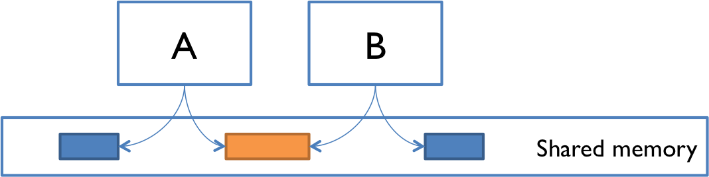

# 并发

## 目标
- 并发的消息传递和共享内存模型
- 并发进程和线程，以及时间分片 (Time Slicing)
- 条件竞争 (Race Conditions) 的危险性

## 并发
并发意味着同时进行多个计算，并发在现代编程中无处不在：
- 网络中的多台计算机
- 一台计算机上运行的多个应用程序
- 一台计算机中的多个处理器（今天，通常在单个芯片上有多个处理器内核）

并发在现代编程中至关重要：
- 网站必须同时处理多个用户。
- 移动应用程序需要在服务器上进行处理。
- 图形用户界面几乎需要不打断用户的后台工作

## 两种并发编程模型
共享内存和消息传递。

### 共享内存

并发模块通过在**内存中读写共享对象**进行交互。
- A 和 B 可能是同一台计算机中的两个处理器，共享相同的物理内存。
- A 和 B 可能是同一台计算机上运行的两个程序，读取和写入的文件共享一个公共文件系统。
- A 和 B 可能是同一 Java 程序中的两个线程，共享相同的Java对象。

### 消息传递

并发模块通过**使用通信通道相互发送消息**来进行交互。
模块发送消息，并且将每个模块的传入消息排队等待处理。
- A 和 B 可能是网络中的两台计算机，通过网络连接进行通信。
- A 和 B 可能是 Web 浏览器和 Web 服务器。A 打开与 B 的连接并请求网页，然后 B 将网页数据发送回 A。
- A 和 B 可能是即时消息客户端和服务器。
- A 和 B 可能是在同一台计算机上运行的两个程序，它们的输入和输出通过管道连接起来，例如 `ls|grep`

## 进程，线程，时间分片
消息传递和共享内存模型与并发模块如何通信有关。并发模块本身分为两种：进程和线程。

## 进程 (Proecss)
进程是**与同一台计算机上的其他进程隔离的正在运行的程序的实例**。
特别是，它在**机器内存中有自己的专用部分**。

进程的抽象是一个虚拟的计算机，它让程序感觉自己拥有整个机器。
就像创建了一台新的计算机，拥有新的内存，就是为了运行这个程序。
- 进程之间通常不共享内存，一个进程根本无法访问另一个进程的内存或对象
- 在大多数操作系统上，进程之间共享内存是可能的，但需要 special effort（特别的努力）
- 一个新的进程是自动准备好进行消息传递的，因为它是用标准的输入和输出流创建的，也就是你在Java中使用过的System.out和System.in流。
每当你启动一个Java程序时--事实上，每当你启动计算机上的任何程序时，它都会启动一个新的进程来包含正在运行的程序。

## 线程 (Thread)
