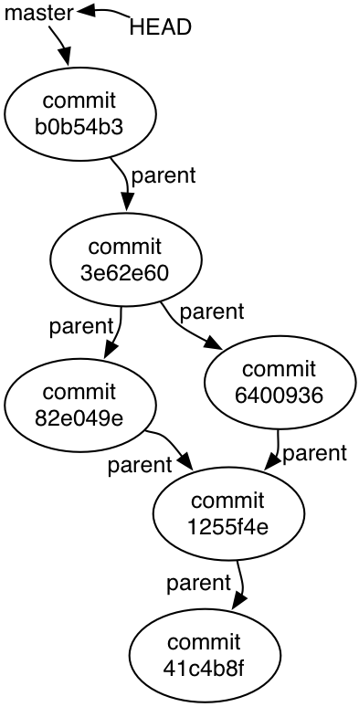

# 版本控制
pro git: https://git-scm.com/book/zh/v2
## 一个程序员的版本控制方案  
- 恢复到过去的版本
- 比较两个不同的版本
- 将完整的版本历史记录推送到云
- 从某个位置拉回历史
- 合并属于相同早期版本的内容

## git
- Git项目的历史是有向无环图（DAG）

- 如果他们两个都编辑了相同文件的相同部分，则 Git将报告合并冲突
  - 需要手动更改
- `git show`
  - 询问某个早期版本的文件的内容
 
 