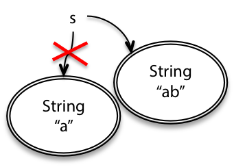
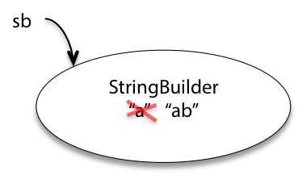
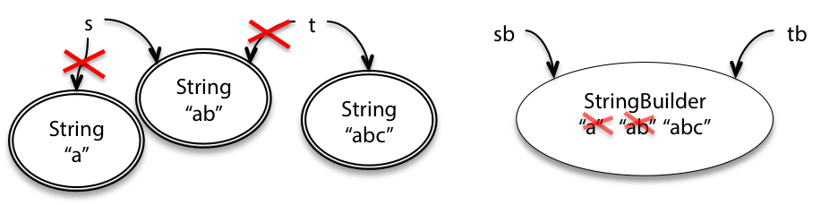
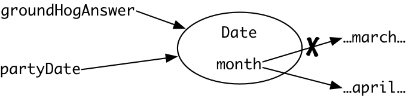
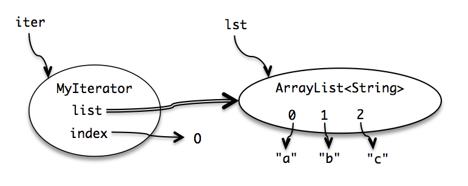
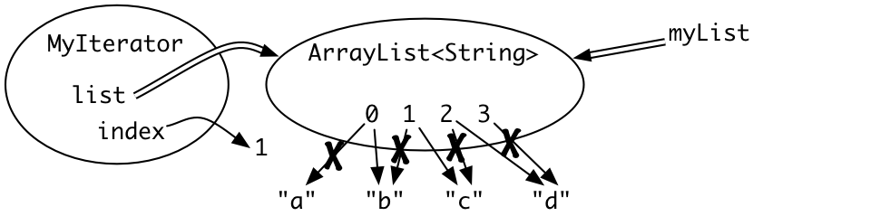

# 可变性和不变性

## String 与 StringBuilder
- `String` 是不可变类型
  - 一个`String`对象总是代表相同的字符串
  - 要改变 `String` 必须创建新的 `String` 对象 
    - `String s = "a"; 
       s = s.concat("b"); // s+="b" and s=s+"b" also mean the same thing`



- `StringBuilder` 是可变类型的示例
  - 具有改变对象值的方法
    - `StringBuilder sb = new StringBuilder("a");
       sb.append("b");`
  



### 要点

- 不变性
  - 更改 t 不会对 s 产生影响
- 可变性
  - 更改 t, t 和 s 都发生变化
- 为什么已经有了不变性还要考虑可变性呢？

```java
// 不变性的字符串拼接 O(n2)
String s = "";
for (int i = 0; i < n; ++i) {
    s = s + n;
}

// 可变性的字符串拼接 O(n)
StringBuilder sb = new StringBuilder();
for (int i = 0; i < n; ++i) {
  sb.append(String.valueOf(i));
}
String s = sb.toString();
```
- 获得良好的性能是使用可变对象的原因
- 方便共享：程序的两个部分更方便地通信。
  
## 使用可变值的风险
- 不可变类型更安全，更容易理解，更易于更改
- 可变性更难理解程序在做什么，难以执行规范要求
### 将可变对象传递给函数会导致问题
- 如果在某个函数中改变了可变值，可能导致不可预料的后果
- 安全原则
  -  传递可变对象是一个潜在的错误
  - 一些程序员无意间更改，会导致难以跟踪的错误
- 容易理解原则
  - 读代码的人难以知道可变对象发生了改变
- 
### 返回可变对象会导致问题
- `return askGroundhog();`
- 如果有多个调用该函数（返回的是可变对象）的话
- 会发生不可预料的错误
- 并且不知道哪个调用的函数会先发生错误



- 如何解决这问题？
  - 防御性复制
    - `return new Date(groundhogAnswer.getTime());`
    - 其为每个客户端进行额外的工作并使用额外的空间
    - 占用了大量的内存空间
  - 改用不可变类型
    - 更少的复制和更少的内存空间
    - 永远不需要防御性地复制
### 别名使可变类型具有风险
- 同一可变对象具有多个引用
- 别名在代码的完全不同部分中，由不同的程序员控制，可能不知道其他人在做什么
- 如果未表明可以对输入进行突变，我们假定不允许对输入进行突变

## iter 的本质
  

```java
List<String> lst = ...;
for (String str : lst) {
    System.out.println(str);
}
// 被改写为
List<String> lst = ...;
Iterator iter = lst.iterator();
while (iter.hasNext()) {
    String str = iter.next();
    System.out.println(str);
}
```
- this 表示实例对象
  - (根据 CS61A 内容可知) 对象实例化后的内容，其实只包括用 this 绑定的变量的内容
  - 每个实例的空间内只储存了用 this 绑定后的变量所占用的空间

### 为什么使用迭代器
- 有不同内部表示形式的集合数据结构（链接列表，映射，哈希表）
- 迭代器概念允许一种统一的方式来访问所有对象
- 是一种有效的设计模式

### 突变破坏了迭代器
```java
public static void dropCourse6(ArrayList<String> subjects) {
    MyIterator iter = new MyIterator(subjects);
    while (iter.hasNext()) {
        String subject = iter.next();
        if (subject.startsWith("6.")) {
            subjects.remove(subject);
        }
    }
}
// dropCourse6(["6.045", "6.005", "6.813"])
//   expected [], actual ["6.005"]
```
- 为什么？
  - 迭代器中的 index 始终 + 1

```java
public class MyIterator {

    private final ArrayList<String> list;
    private int index;

    ...

    public String next() {
        final String element = list.get(index);
        ++index;  // 每次调用都 + 1
        return element;
    }
}
```

- 内置的迭代器也存在这个问题，因此无法在 `for { : }` 循环中进行结构上的改变
  - 即对该集合使用add、remove或clear方法

```java
for (String subject : subjects) {
    if (subject.startsWith("6.")) {
        subjects.remove(subject);
    }
}
```

- 会得到一个 `ConcurrentModificationException`

- 如何解决？
  - 直接对迭代器进行更改

```java
Iterator iter = subjects.iterator();
while (iter.hasNext()) {
    String subject = iter.next();
    if (subject.startsWith("6.")) {
        iter.remove();
    }
}
```

- 为什么用 `iter.remove()` ?
  - 看一下 ArrayList 的 Iterator 源码就知道了
  
```javas
private class Itr implements Iterator<E> {
        int cursor;       // index of next element to return 下一个元素的标签
        int lastRet = -1; // index of last element returned; -1 if no such 最近返回的元素
        int expectedModCount = modCount; // pass

        public boolean hasNext() {
            return cursor != size;
        }

        @SuppressWarnings("unchecked")
        public E next() {
            checkForComodification();                          // pass
            int i = cursor;                                    // pass
            if (i >= size)                                     // pass
                throw new NoSuchElementException();            // pass
            Object[] elementData = ArrayList.this.elementData; // pass
            if (i >= elementData.length)                       // pass
                throw new ConcurrentModificationException();   // pass
            cursor = i + 1;                                    // 调整了 cursor
            return (E) elementData[lastRet = i];               // 调整了 lastRet
        }

        public void remove() {
            if (lastRet < 0)                           // pass
                throw new IllegalStateException();     // pass
            checkForComodification();                  // pass

            try {
                ArrayList.this.remove(lastRet);        // 把 ArrayList 的 lastRet 的这个 index 的元素删掉了，这也说明了每次 iter.remove() 的时候必须 next()
                cursor = lastRet;                      // 顺便调整了 cursor, 避免了 cursor 每次 next() 的时候 + 1 跳过元素的现象
                lastRet = -1;                          // lastRet 初始化了
                expectedModCount = modCount;           // pass
            } catch (IndexOutOfBoundsException ex) {   // pass
                throw new ConcurrentModificationException();  // pass
            }
        }

        final void checkForComodification() {
            if (modCount != expectedModCount)
                throw new ConcurrentModificationException();
        }
}
```


- 是的，会产生图中这样的错误
- 我的元素少了一个了， index 还是 + 1

## 突变与规范
### 可变对象可以使简单规范变得非常复杂
- 对同一可变对象的多次引用意味着多个位置都依赖于该对象保持一致
- 为了提高性能和方便性，我们仍然必须这样做，但是为此，我们在错误安全性方面付出了巨大的代价。
### 可变对象降低了可变性
- 使用可变对象会使代码更难更改
  - 假设我们有一个客户端使用 `char[]` 保存用户名
  - 客户端担心用户的隐私，并决定模糊ID的前5位
  - 实现者担心数据库的速度和负载，因此引入了一个缓存会记住已查找的用户名
  - 缓存指向同一个 char 数组，将来调用时会返回模糊的版本 “ ***** 2033”

### 解决方法
```java
public static char[] getMitId(String username) throws NoSuchUserException 
  requires: nothing
  effects: returns an array containing the 9-digit MIT identifier of username,
             or throws NoSuchUserException if nobody with username is in MIT’s
             database. Caller may never modify the returned array.
```
- 这是一个不好的方法 （调用者永远不能修改返回的数组。）
  - 必须在整个程序的所有其余部分都有效
  - 写的其他规范的范围会因此变窄得多
  
```java
public static char[] getMitId(String username) throws NoSuchUserException 
  requires: nothing
  effects: returns a new array containing the 9-digit MIT identifier of username,
             or throws NoSuchUserException if nobody with username is in MIT’s
             database.


```
- 这是一个不好的方法 （返回一个新数组 char[] ）
  - 如果以后要修改原 `char[]` 该怎么办？
  - 新 `char[]` 是否避免了持有一个别名？

- 好方法是什么？

```java
public static String getMitId(String username) throws NoSuchUserException 
  requires: nothing
  effects: returns the 9-digit MIT identifier of username, or throws
             NoSuchUserException if nobody with username is in MIT’s database.

```
- 返回一个 `String` ，不可变性带来的保证
  - 客户端和实现者将永远不会像使用 `char[]` 那样互相影响对方
  - 不依赖于程序员仔细阅读规范注释
  - 字符串是不可变
  - 实现者可以自由地引入缓存提高性能
    
## Java 的不可变类型
- 何为不可变类型？
  - 如果它的所有实例都是同一个值，那么这个类是不可变的
  - 不可变类型使得可以从局部推理出类型的值，而可变类型要全局进行推理
- 原始类型和原始包装器都是不可变的
- `BigInteger` 和 `BigDecimal` 是不可变的
- Date 可变，但 java.time 不可变
- 集合类型都是可变的
- 空集合不可变 `Collections.emptyList`

## 总结
- 可变性
  - 性能、便利性
  - 错误的风险
- 不可变对象（String）和不可变引用（final）之间的区别
  - 不可变的对象带有双边框，表示它从不更改其值
  - 引用是指向对象的指针，不变的引用是带有双线的箭头，指示该箭头无法移动以指向其他对象。
- 设计原则
  - 不变性
  - 尽可能使用不变的对象和不变的引用

- 三个原则
  - 安全的错误
    - 不可变的对象不受到别名引起的错误
    - 不可变的引用始终指向同一对象
  - 容易理解
    - 不可变的对象或引用始终意味着一件事，因此代码阅读者可以轻松推理
    - 不必遍历所有代码来查找可能更改对象或引用的所有位置，因为它无法更改
  - 准备改变
    - 不可变类型，程序更改时不必修改依赖于该对象或引用的其他代码