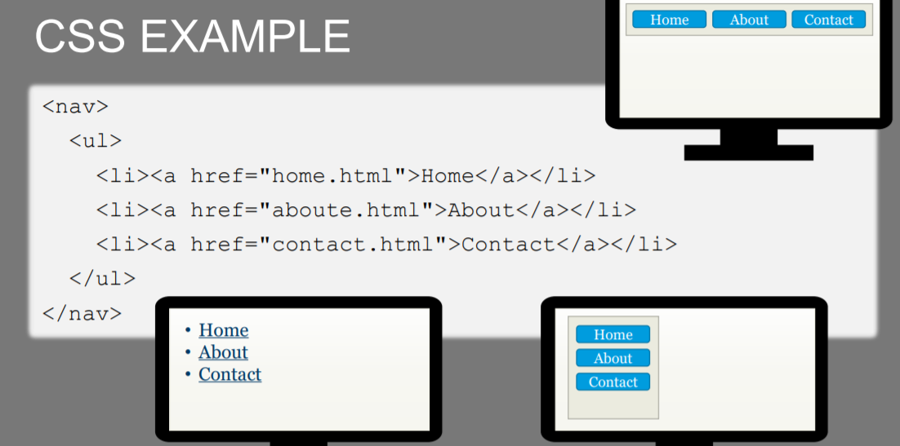
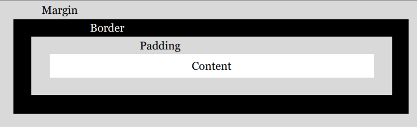
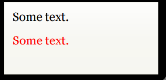
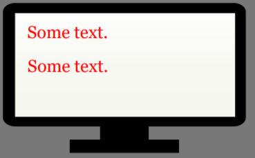

# CSS Tutorial

## Introduction

In the last tutorial, we have mentioned HTML, a markup language. It is like Markdown, provide you multiple elements like `<h1>` to write well-structured contents.  HTML tells browsers what types of data a content represents. e.g. `<h1> Head </h1>` tells your browser that this is a heading. While **CSS** tells browsers how to render those the data. In short, HTML control contents, while CSS control the style.

Let is take a look at an example,



where the `<nav>` tag means navigation, tells the browser that the content inside the `ul` is the website navigation.

## The Box Model

All elements are rendered as boxes. If you want to prettify a content, you can only work with the box model.



## Where To Write CSS Code

1. In a element attribute

   Hard-coded into a element.

   `<p style="CSS-CODE">Some text</p>`

   - Can not re-use CSS code in other element.

2. In the `Style` element:

   `<style>CSS-CODE</style>`

   - You can define a `<Style>` element and use it in other HTML elements.
   - Need to specify which elements that should be affected (Selector).
   - Can not re-use CSS code in other HTML files.

   

3.  In a seperate CSS file: Optimal option

   `<link rel="stylesheet" href="the-css-file.css">`

   - Need to specify which element that should be affcted.
   - can use in other elements and HTML files.
   - CSS files can be cached. : )

CSS code can be applied to HTML elements on a webpage in three different ways:

- Using the `style` attribute.
- Using the `<style>` tag.
- Using the `<link>` tag and an external CSS file.


## CSS Syntax

### Declaration:  `key : value` 

`property-name: value;`

#### e.g. 1:

```html
<p>Some text.</p>
<p style="color: red">Some text.</p>
```

rendered like this:



### Other snytax:

```html
selector{
declarations
}
```

where selector is the element that should be affcted.

e.g. 

```html

<style>
p{
color: red
}
</style>

<p>Some text.</p>
<p>Some text.</p>
```

where all `<p>` elements should be rendered as red.



## CSS Selector

selector are used to denote which element should be rendered.

- `tagname`: `<p>` etc.
- `#the-id`: the attribute `id="the-id"` inside a element.
- `.a-class-name`: the attribute `class="a-class-name"` inside a element.
- `*`: all elements.

### e.g.:

```html
<style>
p{ color: red }
#cool{ font-weight: bold }
.happy{ background-color: lime }
</style>
<p>Some text.</p>
<p class="happy">Some text.</p>
<p id="cool">Some text.</p>
<div class="happy">Some text.</div>
```

### rendered result:


## Relational Selectors

